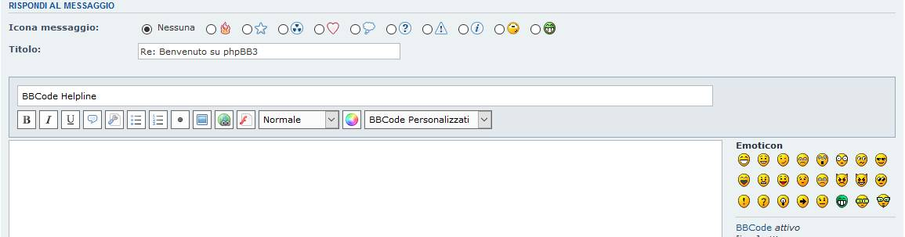
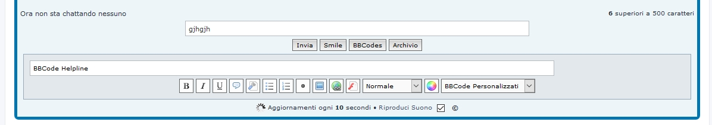

# X-BBcode Silk Buttons
**Extension Version:** 1.3.0  

on mChat extension  

**Description:** Turn normal bbcode button into graphical silk buttons. The Extension also provide to group custom bbcodes into selectbox for a better choise. Last but not least an helpline input show the bbcode help message on hover. It's a cosmetic ext with zero impact on databse.  
Inspired from the original Idea build by Stoker Mod.  

**Author:** [Sir Xiradorn](https://www.phpbb.com/community/memberlist.php?mode=viewprofile&un=Sir%20Xiradorn "Sir Xiradorn")

**Original Author:**  
* **Stoker** (MOD)  
* **famfamfam** - silk icon  

**Requirements:**  
* ***phpBB 3.1.x*** or ***phpBB 3.2.x***  

**Repository:** X-BBcode Silk Buttons - https://github.com/XiradornLab/phpbb_xbbcodesilkbtn  
**Release Download:** X-BBcode Silk Buttons - https://github.com/XiradornLab/phpbb_xbbcodesilkbtn/releases  

**Features:**  
* bbcode buttons turned into graphical button with icons  
* custom bbcode into select box  
* helpline message on hovering  
* mChat compatible  

**Installation:**
* Download the latest release from (https://github.com/XiradornLab/phpbb_xbbcodesilkbtn/releases).
* Unzip the downloaded release, and change the name of the folder to `xbbcodesilkbtn`.
* In the `ext` directory of your phpBB board, create a new directory named `xiradorn` (if it does not already exist).
* Copy the `xbbcodesilkbtn` folder to `/ext/xiradorn/` (if done correctly, you'll have the main extension class at (your forum root)/ext/xiradorn/xbbcodesilkbtn/composer.json).
* Navigate in the ACP to `Customise -> Manage extensions`.
* Look for `X-BBcode Silk Buttons` under the Disabled Extensions list, and click its `Enable` link.[/list]

**Update Instructions:**  
* disable the extension
* delete extension data
* delete extension files from server
* download latest extension files from GitHub(if you haven't already)
* upload new files to the server
* enable extension
* in some cases, the board cache needs to be cleared

**Style Support:**  
Currently it perfectly work on prosilver. Other style will be probably added in future.  

**Permissions:**  
Works with normal bbcode permission  

Thank you so much for all your suggestions.  